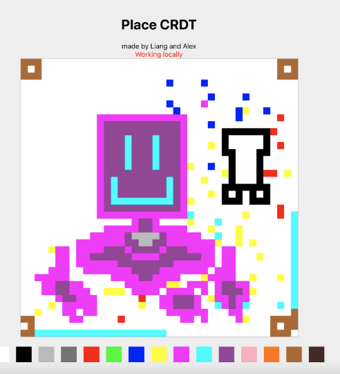

# Place CRDT

Made by Liang Liu and Alex Han for Tony Mason CPSC 416 2022W2 term.

Visit https://placecrdt.stuffbyliang.com/ to check it out!

## Description

Place CRDT is a recreation of Reddit’s r/place that allows users to place pixels without the need for an internet connection.

It is a 40-by-40 pixel board (1600 total pixels) that supports concurrent placement of multiple pixels with different colors. Live pixel placements are supported where changes happen in real-time and are thus viewable by all users connected to the site.



## Design

Please visit the [design doc](https://docs.google.com/document/d/1at68fO_Cb8EJcHdj9-fP0wl7DwuvbAw3WdO87m8eImc/edit?usp=sharing) for more information on the design, and background of CRDTs and r/place!

## Project Structure

`backend`: contains the backend express/websocket node.js server
- Entrypoint: `backend/src/server.ts`

`frontend`: contains the frontend pixel canvas react application.
- Entrypoint: `frontend/src/App.tsx`

## How to Run and Develop

### Run Locally

To start the backend server, run:

```
cd backend
yarn install
yarn start
```

To start the frontend local development server, run:

```
cd frontend
yarn install
yarn start
```

Then visit [localhost:3000](localhost:3000)

### Building the Project

To build the project and deploy, run

```
cd frontend
yarn build
yarn serve
```

Then visit [localhost:4160](localhost:4160)

## How to Run Tests

To run the backend tests, run:

```
cd backend
yarn test
```

To the run the frontend tests, run:

```
cd frontend
yarn test
```

## Any questions?

Please leave a github issue!
